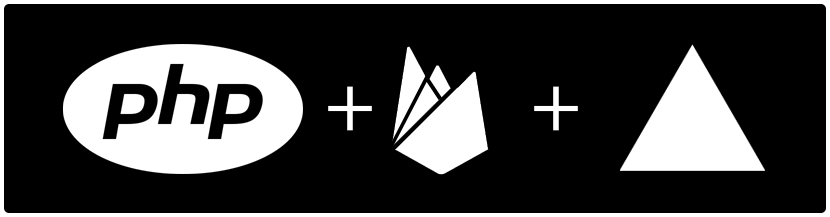

## <p align="center">Example API structure in PHP - MVC with Database Firebase for deployment in Vercel </p>
<p align="center">
  <a href="#php+firebase+vercel"></a>
</p>

## Example JSON Structure in Database Firebase 

    name-your-database
    ├── public              
    ├── private                 

- ```[public]``` -> Aqui crie as pastas/chaves que conterá os dados que pode ser público, acessado por qualquer usuário da Api.
- ```[private]``` -> Aqui crie as pastas/chaves que conterá os dados privados

### Example:

    name-your-database
    ├── public    
    │   └── posts  
    │   └── products  
    ├── private                
    │   └── users              
     

## Dependencies
>Para produção, necessário para fazer conexão com Firebase
- [Firebase Admin SDK for PHP](https://firebase-php.readthedocs.io/en/5.x/)

   └── ```composer require kreait/firebase-php```

> Para ambiente de desenvolvimento, necessário para usar as variáveis de ambiente (.env)
- [PHP dotenv](https://github.com/vlucas/phpdotenv)

   └── ```composer require vlucas/phpdotenv```